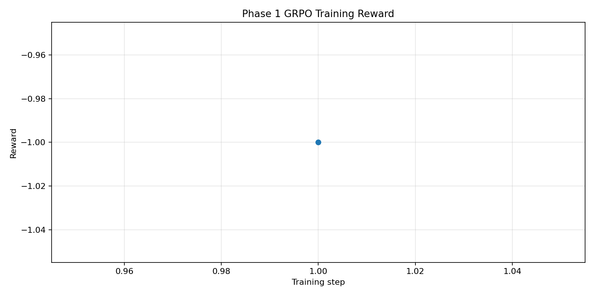
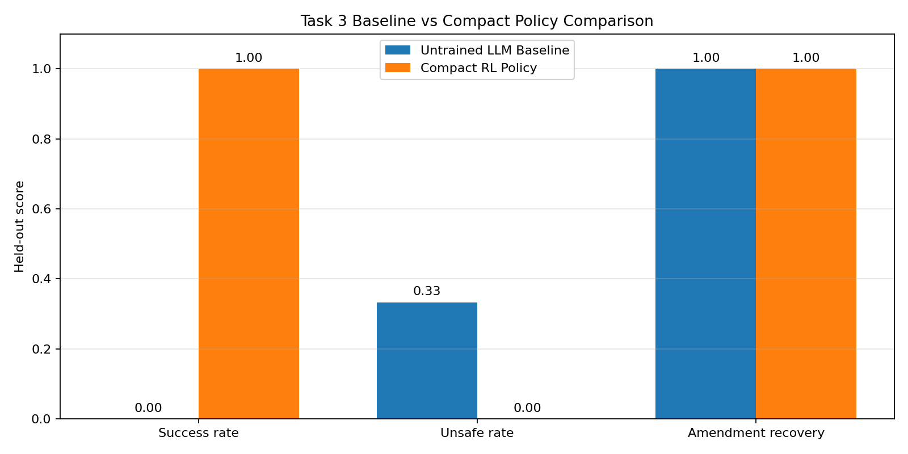

# ClinicalTrialEnv: RL environment for clinical trial workflow execution

ClinicalTrialEnv is an OpenEnv-compatible reinforcement learning environment for multi-step clinical trial coordination. It focuses on stateful, safety-critical workflow execution rather than one-shot text generation.

Judge-facing entry points:

- HF Space demo UI: [https://abisheiks-clinicaltrial-env.hf.space](https://abisheiks-clinicaltrial-env.hf.space)
- Colab quick demo: [notebooks/train_colab.ipynb](notebooks/train_colab.ipynb)
- Short blog: [docs/blog.md](docs/blog.md)
- Training report: [TRAINING_REPORT.md](TRAINING_REPORT.md)

## Problem

Real-world clinical workflows are:

- multi-step
- stateful
- safety-critical
- sensitive to incomplete information and protocol changes

Large language models can sound convincing in this setting while still failing at consistent execution. ClinicalTrialEnv exists to test whether a policy can carry state, react to amendments, and finish the workflow safely.

## Environment Overview

This repository centers on **Task 3**, a Rett syndrome screening workflow with a forced protocol change mid-episode.

Workflow stages:

1. screening
2. amendment activation
3. re-check of affected criteria
4. final decision
5. follow-up scheduling
6. safety-event handling

The goal is not to generate a plausible explanation. The goal is to execute the workflow correctly through the environment's transition rules and reward function.

## API

ClinicalTrialEnv exposes a small OpenEnv HTTP surface:

- `POST /reset`
- `POST /step`
- `GET /state`
- `GET /health`

## Evidence

The project now has four distinct pieces, and they should not be conflated:

1. **Environment**
   ClinicalTrialEnv itself is working and validated as an OpenEnv environment.
2. **Untrained baseline**
   The base language-model policy is weak on Task 3 and fails to complete the workflow reliably.
3. **Failed LM-GRPO attempt**
   The LM-GRPO training pipeline exists, but it did **not** pass validation and did **not** produce a reliable submission-grade policy.
4. **Compact RL policy**
   A smaller compact RL policy does solve the environment, which shows the reward function and transition dynamics are learnable.

| Metric | Baseline | LM-GRPO | Compact Policy |
| --- | ---: | ---: | ---: |
| Success | 0.0 | 0.33 | 1.0 |
| Unsafe | 0.33 | 0.0 | 0.0 |
| Reward | -0.36 | 0.66 | 1.0 |

## What These Results Mean

The important takeaway is narrow and honest:

- the **environment works**
- the **reward signal works**
- the **compact RL policy works**
- the **LM-GRPO pipeline did not become stable enough to count as a validated success**

That means the project demonstrates a valid RL environment and a learnable control problem, but it does **not** justify claiming that the language-model training run solved Task 3.

## Images

Reward curve:



Baseline vs trained comparison:



## Judge Quickstart

If you only have a few minutes, use this order:

1. Open the HF Space UI and inspect the `Baseline run`, `Compact policy run`, and `Explanation` tabs.
2. Open the Colab notebook for a lightweight end-to-end demo without heavy training.
3. Read the short blog for the narrative summary.
4. Use the training report if you want the artifact-backed status of the LM-GRPO attempt.

## How to Run

### Local

Install dependencies:

```bash
pip install -r requirements.txt
```

Start the environment server:

```bash
uv run uvicorn server.main:app --host 0.0.0.0 --port 7860
```

Run the baseline / training scripts from a separate shell as needed:

```bash
python inference.py
```

```bash
python training/grpo_phase1.py --model distilgpt2 --env-url http://localhost:7860
```

### Hugging Face Space

The deployed environment is available as a Docker Space:

- Space: [abisheiks/clinicaltrial-env](https://huggingface.co/spaces/abisheiks/clinicaltrial-env)
- Live app: [https://abisheiks-clinicaltrial-env.hf.space](https://abisheiks-clinicaltrial-env.hf.space)

The Space UI is intentionally structured for review:

- `Baseline run` shows the failed untrained LM trajectory
- `Compact policy run` shows the successful control policy trajectory
- `Explanation` summarizes why the compact policy succeeds while LM-GRPO did not validate

Quick checks:

```bash
curl https://abisheiks-clinicaltrial-env.hf.space/health
```

```bash
curl -X POST https://abisheiks-clinicaltrial-env.hf.space/reset -H "Content-Type: application/json" -d '{}'
```

## Links

- HF Space: [https://huggingface.co/spaces/abisheiks/clinicaltrial-env](https://huggingface.co/spaces/abisheiks/clinicaltrial-env)
- Training report: [TRAINING_REPORT.md](TRAINING_REPORT.md)
- Technical training notes: [docs/training.md](docs/training.md)
- Blog: [docs/blog.md](docs/blog.md)
- Colab: [notebooks/train_colab.ipynb](notebooks/train_colab.ipynb)

## Honest Conclusion

Environment validated. RL pipeline functional. LLM improvement remains future work.
