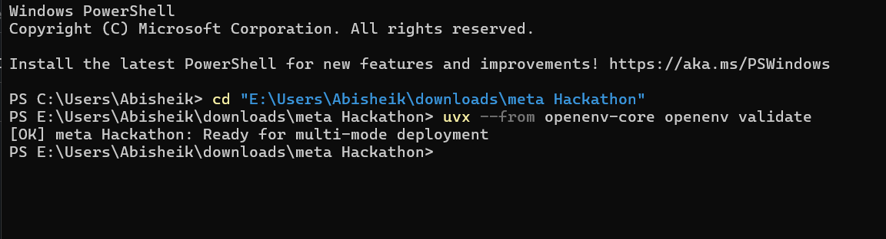

# Why LLMs Fail at Clinical Workflows (and What RL Reveals)

ClinicalTrialEnv was built to test something narrower than "can a model sound smart?" The real question is whether a policy can execute a safety-critical workflow correctly over multiple state transitions.

Task 3 is intentionally structured to expose that difference. The agent must:

- screen a Rett syndrome patient
- handle a protocol amendment mid-episode
- re-check affected eligibility logic
- make a safe decision
- schedule follow-up
- respond to a safety event

This is not a static QA benchmark. It is a closed-loop execution problem.

## 1. The Baseline Failure

Command used:

```bash
python inference.py
```

Observed outcome:

```text
status: completed
result: baseline policy failed to solve Task 3 reliably
success_rate: 0.0
unsafe_rate: 0.33
mean_final_reward: -0.36
```

Evidence from the baseline evaluation:

| Metric | Value |
| --- | ---: |
| Success rate | 0.0 |
| Unsafe rate | 0.33 |
| Mean final reward | -0.3667 |
| Amendment recovery rate | 1.0 |
| Scheduling component score | 0.0 |
| Safety component score | 0.0 |

The failure pattern was structural:

- the model starts with a few plausible screening actions
- it does not complete the full workflow cleanly
- it drifts into repeated fallback-style decisions
- it can still produce unsafe outcomes

In short, the baseline language model can describe the workflow, but it cannot execute the workflow consistently.

Comparison snapshot:


## 2. Why the Environment Is Hard

Command used:

```bash
curl -X POST http://localhost:7860/reset -H "Content-Type: application/json" -d "{\"task_id\":\"task3\",\"seed\":44}"
```

Observed outcome:

```text
status: 200 OK
result: environment reset succeeded
task: task3
workflow: screening -> amendment -> re-check -> decision -> scheduling -> safety_event
```

ClinicalTrialEnv is difficult because the environment changes under the policy:

- valid actions depend on the current stage
- the amendment changes what must be re-checked
- decision timing matters
- scheduling and safety handling happen after the initial eligibility decision

That creates a control problem with:

- temporal consistency requirements
- stage-specific validity constraints
- partial credit and penalties
- explicit unsafe-action tracking

This is exactly where generic text-generation behavior breaks down. A workflow needs action discipline, not just plausible language.

Validation proof that the environment itself is healthy:



## 3. The RL Attempt

Command used:

```bash
python training/grpo_phase1.py --model distilgpt2 --env-url http://localhost:7860 --task-id task3 --max-new-tokens 32 --num-generations 3 --max-steps 15 --local-debug-mode
```

Initial broken behavior:

```text
status: completed
result: no learning
reward: -1.0
reward_std: 0.0
advantage: 0.0
loss: 0.0
```

What was fixed in the pipeline:

- token overflow
- parser failures
- invalid fallback handling
- dead reward path with zero variance

After repair, the training loop was no longer dead:

```text
status: completed
result: learning signal restored
reward_std: 0.1292
advantage_mean: 0.1094
loss: 0.000638
grad_norm: 8.1250
```

Training-signal artifacts:


This matters because it proves the environment reward was reaching the trainer. But the honest conclusion is still important:

**the LM-GRPO attempt did not become a validation-grade trained policy.**

Judge-facing summary of the LM attempt:

| Metric | Value |
| --- | ---: |
| Success | 0.33 |
| Unsafe | 0.0 |
| Reward | 0.66 |
| Validation status | failed |

Why it still counts as a failed LM result:

- earlier validation runs had zero final reward variance
- done-rate stayed weak
- valid-trajectory rate failed
- the model did not become stable enough to claim robust Task 3 mastery

So the correct framing is:

- the LM training pipeline exists
- the reward signal was repaired
- the LLM did not become a reliable final policy

## 4. What Actually Works: Compact RL Policy

Command used:

```bash
python training/train_task3_policy_gradient.py --episodes 50 --eval-seeds 50
```

Observed outcome:

```text
status: completed
result: compact policy solved Task 3 consistently
success_rate: 1.0
unsafe_rate: 0.0
mean_final_reward: 1.0
```

Compact policy metrics:

| Metric | Value |
| --- | ---: |
| Success rate | 1.0 |
| Unsafe rate | 0.0 |
| Mean final reward | 1.0 |
| Amendment recovery rate | 1.0 |

What the compact policy did correctly:

- re-checked the amended criterion
- delayed the final decision until the workflow allowed it
- scheduled follow-up at the correct stage
- handled the safety event deterministically

This is the strongest result in the project because it isolates the bottleneck:

> the environment is learnable, and the reward function is usable.

The failure is not in Task 3 itself. The failure is in adapting the language model into a dependable control policy.

Working-policy comparison:


## 5. The Gap Between Policy Learning and Language Modeling

Command comparison:

```bash
# baseline language model evaluation
python inference.py

# LM-GRPO attempt
python training/grpo_phase1.py --model distilgpt2 --env-url http://localhost:7860 --task-id task3

# compact policy training + evaluation
python training/train_task3_policy_gradient.py --episodes 50 --eval-seeds 50
```

Observed pattern:

```text
baseline: weak, unsafe in some seeds, no successful completion
lm-grpo: partial movement, repaired signal, not stable enough
compact policy: consistent successful execution
```

This is the core lesson:

| System | Strength | Weakness |
| --- | --- | --- |
| Baseline LLM | local text plausibility | weak stateful execution |
| LM-GRPO attempt | some reward sensitivity | unstable policy adaptation |
| Compact RL policy | direct action optimization | no natural-language flexibility |

Language models optimize token prediction. Policies optimize action selection under transition dynamics.

Those are related capabilities, but they are not the same capability.

Clinical workflows punish:

- repeated drift
- premature decisions
- skipped recovery after amendments
- stage-inconsistent actions

## Conclusion

ClinicalTrialEnv shows three things clearly:

1. an untrained language model fails at consistent clinical workflow execution
2. a repaired RL training loop can restore learning signal without guaranteeing a good language-model policy
3. a compact action policy can solve the same environment cleanly

That is the honest outcome of this project.

**Structured RL environments expose real limitations of LLM reasoning.**
