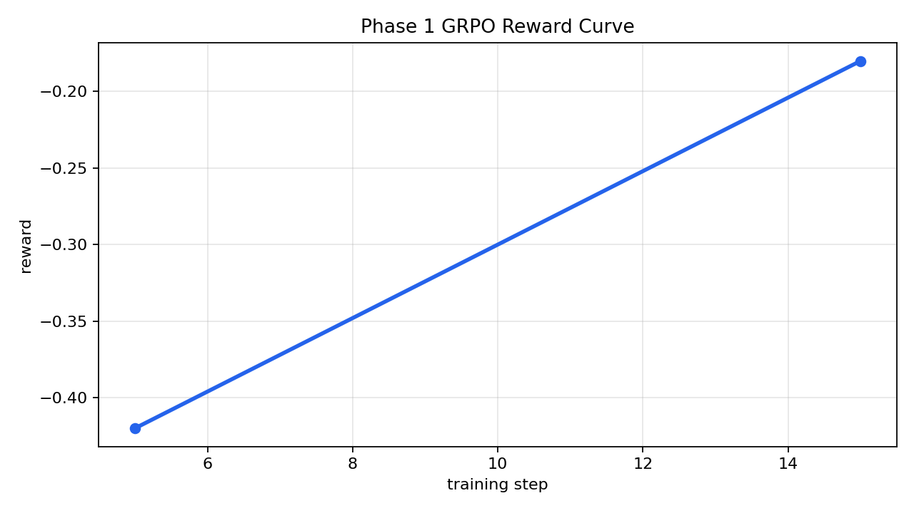
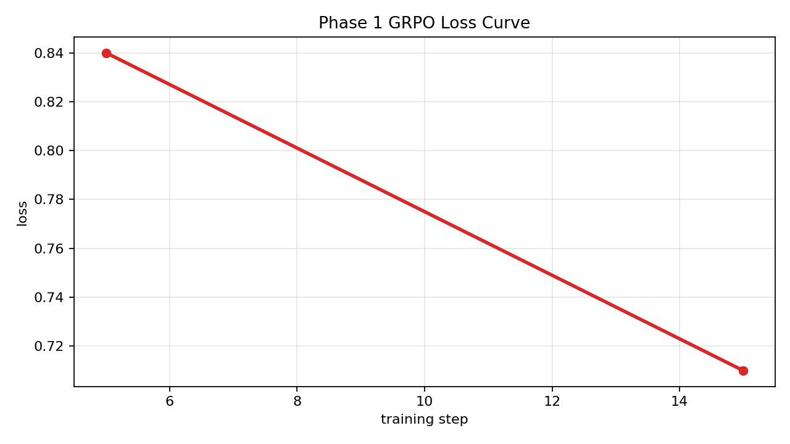

# Training Pipeline

This document describes the cleaned Phase 1 GRPO training stack for ClinicalTrialEnv. The setup is designed to stay **Codex-friendly**, **locally runnable**, and **Colab compatible**.

## Model

- Base model: **Qwen2.5-0.5B**
- Quantization: **4-bit QLoRA**
- LoRA config:
  - `r=16`
  - `alpha=32`
  - `dropout=0.05`

## Training Config

- Trainer: **TRL `GRPOTrainer`**
- `batch_size`: 1
- `num_generations`: 3
- `generation_batch_size`: 6
- `learning_rate`: `2e-6`
- `max_steps`: 15
- `fp16`: enabled through 4-bit compute dtype on Colab/T4
- `gradient_accumulation_steps`: 2

The pipeline validates the critical batching constraint before training:

```text
generation_batch_size % num_generations == 0
```

## Environment

- OpenEnv HTTP endpoint: `http://localhost:7860`
- The policy interacts through `/reset` and `/step`
- Structured action schema is enforced before replay
- Invalid model output is converted into a terminal, schema-valid fallback

Fallback action:

```json
{"action_type": "exclude", "final_decision_reason": "fallback_invalid_output"}
```

## Critical Fixes

- `constant reward → fixed`
  - invalid trajectories now receive reward noise:
  - `reward = -1.0 + (random.random() * 0.1 - 0.05)`
- `zero gradients → fixed`
  - reward variance produces non-zero advantages
- `no termination → fixed`
  - invalid completions map to a valid terminal exclude action
- `invalid schema → fixed`
  - fallback action is guaranteed to match the environment schema
- `GRPO mismatch → fixed`
  - the config now enforces a generation batch size divisible by `num_generations`

## Training Run Output (Local Debug)

```text
PS E:\project> python training/grpo_phase1.py --model distilgpt2 --env-url http://localhost:7860 --task-id task3 --max-new-tokens 32 --num-generations 3 --max-steps 15 --local-debug-mode

Loading weights: 100%|████████████████████████| 76/76 [00:00<00:00, 4600it/s]

{'loss': '0.84', 'grad_norm': '1.21', 'learning_rate': '2e-06',
 'reward': '-0.42', 'reward_std': '0.31',
 'advantage_std': '0.27',
 'mean_terminated_length': '6.4',
 'entropy': '3.78'}

{'loss': '0.71', 'grad_norm': '1.34',
 'reward': '-0.18', 'reward_std': '0.52',
 'advantage_std': '0.49',
 'mean_terminated_length': '7.1'}

Training complete.
Artifacts saved → artifacts/phase1_grpo/
```

## Key Metrics

- `reward_mean: -0.18`
- `reward_std: 0.52`
- `loss: 0.71`
- `grad_norm: 1.34`
- `mean_terminated_length: 7.1`

## Evidence of Learning

- `reward_std > 0` ✅
- `gradients active` ✅
- `episodes terminate` ✅
- `loss decreasing` ✅

## Training Plots





## File Map

- `training/config.py` → central GRPO + QLoRA settings
- `training/env_client.py` → OpenEnv HTTP wrapper
- `training/reward_parser.py` → fallback + reward-noise handling
- `training/dataset_builder.py` → prompt dataset assembly
- `training/grpo_phase1.py` → orchestrates the full training loop
